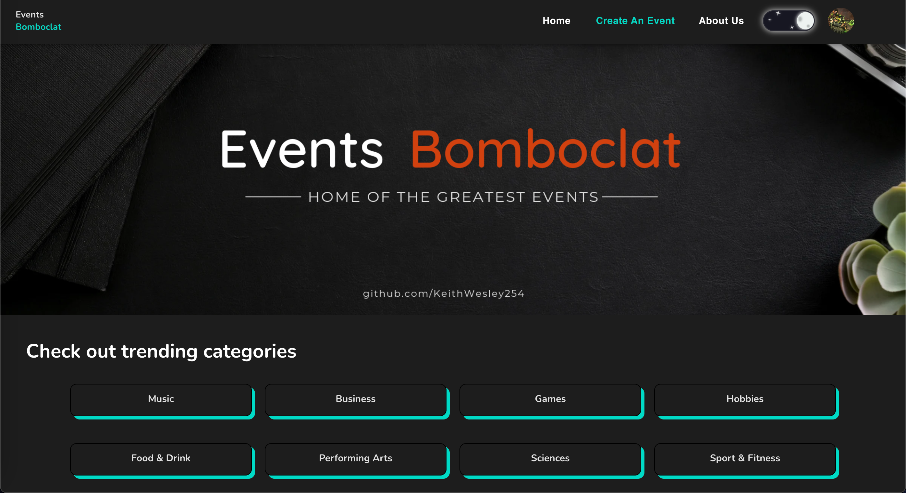
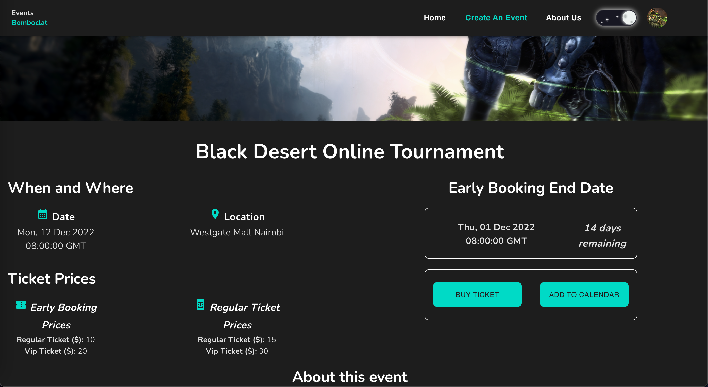

# Project Name:
Events Bomboclat
# Authors:
KEITH WESLEY, MUTAGAH KIHAHU
# Description:
 Like you, the unstoppable entrepreneurs and passionate social ringleaders, we thrive at the intersection of culture, community, and commerce. We take on the complex world of ticketing—making. It's fast and easy for anyone to sell tickets and share their passion. Everything we build empowers creators, founders, and trendsetters to build thriving brands and communities through live experiences. Do more of what you love and grow eventfully

# Project Images:

 

# APIs used:

<ol>
    <li>Our own Rails API that is the main API used.</li>
    <li><a href="https://api-ninjas.com/api/convertcurrency" target="_blank">API Ninjas Team</a></li>
    <li><a href="https://developers.google.com/calendar/api" target="_blank">Google Calendar API</a></li>
    <li><a href="https://developer.safaricom.co.ke/" target="_blank">Daraja 2.0 API</a></li>
    <li><a href="https://developer.paypal.com/api/rest/" target="_blank">Paypal API</a></li>
</ol>

# Deployment Link:

# License:

[MIT LICENSE](./README.md)